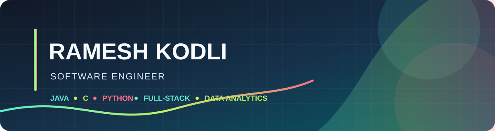

	

	
	
	
	

## About

I build practical applications across Java and web development, with a focus on clear user flows, useful validation, and maintainable code. I’m also growing my skills in data analytics and turning data into useful insights.

## Technologies

	
	
	
	
	
	
	
	

## What I'm Building

- Java desktop applications for student grades, stock portfolios, and hotel reservations.
- Web applications with Node.js, Express, and browser-based interfaces.
- Small projects exploring REST APIs, authentication, middleware, caching, and background jobs.
- Data analytics skills focused on exploring and communicating data.

## Selected Work

	
	
	
	

---

I’m continuing to grow my portfolio through hands-on projects in Java, full-stack development, and data analytics.
